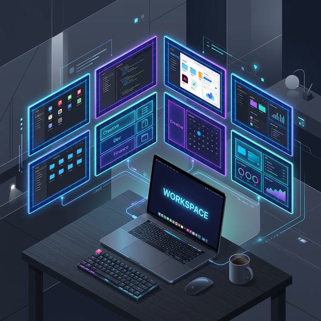

# ScreenBuddy




**ScreenBuddy**는 macOS 사용자를 위한 강력한 화면 및 윈도우 관리 도구입니다. 
빠른 가상 워크스페이스 전환부터 다양한 윈도우 타일링(BSP, Grid 등), 상단 메뉴바 시스템 자원 모니터링, 그리고 외장 모니터 연결 시 내장 디스플레이를 완벽히 끄는 기능까지 멀티 모니터와 멀티태스킹 환경을 극대화시켜주는 올인원 유틸리티입니다.


## 🚀 설치 방법

Homebrew를 통해 빠르고 간편하게 설치할 수 있습니다:

```bash
# 커스텀 탭 추가
brew tap box-kr/homebrew-screen-buddy

# ScreenBuddy (screen-buddy) 설치
brew install --cask screen-buddy

```


### 업데이트 방법
설치 후 새로운 버전이 출시되었을 경우, 아래 명령어를 통해 최신 버전으로 업데이트할 수 있습니다.
```bash
brew upgrade screen-buddy
```


설치 후 `애플리케이션(Applications)` 폴더에서 ScreenBuddy를 찾아 실행해주세요.
> ⚠️ **접근성 권한 안내:** 앱을 최초 실행할 때 단축키와 창 관리를 수행하기 위해 macOS의 [시스템 설정] -> [개인정보 보호 및 보안] -> [접근성] 권한 허용이 필요합니다.

---

## 💡 주요 기능

### 1. 🗂 빠르고 쾌적한 가상 워크스페이스 (Workspace)
macOS 기본 '미션 컨트롤(Mission Control)' 전환 애니메이션의 거슬림 없이, **0초 딜레이로 즉각 화면을 전환**하는 가상 워크스페이스 기능을 제공합니다.
- 여러 모니터별로 별도의 워크스페이스를 독립적으로 관리할 수 있습니다.
- 미리 지정한 단축키 하나로 여러 창을 그룹화하고 즉시 숨기거나/보여주는 방식으로 작동합니다.

### 2. 🪟 혁신적인 윈도우 타일링 및 배치 (Layout)
원하는 작업 스타일에 맞춘 4가지 레이아웃(Tiling Mode) 시스템을 지원합니다.
* **BSP (Binary Space Partitioning)**: 화면을 자동으로 분할하여 빈 공간 없이 모든 창을 낭비 없이 알맞게 배치합니다.
* **Grid**: 여러 윈도우를 바둑판(격자) 모양으로 정렬시킵니다.
* **Float**: 창들이 타일링에 간섭받지 않고 자유롭게 떠다닐 수 있는 모드입니다.
* ✨ **Free (자유 영역 선택 모드)**
  * 가장 진보된 레이아웃 방식으로, Free 모드 단축키를 활성화하면 **반투명한 화면 전체 오버레이 격자**가 나타납니다.
  * 상단 중앙 얇은 헤더에서 현재 선택된(포커싱된) 앱의 로고와 이름을 즉시 확인합니다.
  * 마우스로 원하는 만큼 영역을 **드래그(드래그 시 파란색 음영 표시)**하여 놓으면, 해당 앱의 크기와 위치가 드래그한 비율에 맞춰 즉각 재배치됩니다.
  * 상단의 톱니바퀴⚙️ 아이콘을 통해 세부적인 행(Row)과 열(Column) 개수를 취향에 맞게 영구 저장 및 설정할 수 있습니다.

### 3. 💻 스마트 내장 디스플레이 제어 (Display Blackout)
단순한 화면 밝기 0 처리가 아닙니다. 외장 모니터와 맥북을 함께 사용할 때 마우스가 꺼진 화면으로 넘어가지 않도록, 완전한 화면 제어를 지원합니다.
* **자동 화면 끄기/켜기**: 외장 모니터가 연결되면 자동으로 내장 디스플레이를 완전 블랙아웃 상태로 전환(Sleep 제어)하고, 연결이 해제되면 다시 원래대로 켭니다(Auto-Restore).

### 4. 📊 메뉴바 시스템 모니터링
상단 메뉴바에서 맥북의 핵심 상태를 직각적이고 예쁜 테마로 확인하세요.
* **CPU / Memory**: 현재 사용량 그래프 및 실시간 부하 모니터링
* **Disk / Network**: 남은 디스크 용량, 현재 연결된 Wi-Fi SSID 및 로컬/퍼블릭 IP 제공

### 5. 🧑‍💻 노치 가리기 (Hide Notch) & 커스텀 단축키
* 상단 메뉴바의 색상을 강제 블랙으로 변환해 노치를 깔끔하게 숨겨줍니다. (Cmd+H+H 등 커스텀 단축키 연동 가능)
* 창 포커스 이동, 워크스페이스 1~9 전환, 레이아웃 변경 등을 전부 나만의 단축키로 커스텀할 수 있어 마우스 없이 키보드만으로 모든 조작이 완료됩니다.

---

## 🛠 사용 방법 및 단축키 설정
앱 실행 후 상단 메뉴바의 아이콘을 클릭한 뒤 **[설정(Preferences)]**으로 들어오시면 모든 기능을 세팅할 수 있습니다.
* **Layout 탭**: BSP, Grid, Float 등의 레이아웃의 여백(Padding/Gap) 등을 설정할 수 있습니다.
* **Shortcuts 탭**: 사용 중인 다른 앱의 단축키와 겹치지 않게, 각 워크스페이스나 레이아웃 변경 커맨드를 직접 타이핑하여 변경할 수 있습니다.

---

## 📝 릴리스 노트 (Release Notes)

### [v1.0.24] - 2026-05-24
* **메뉴바에 키보드 조명 수동 ON/OFF 메뉴 및 단축키 추가**: 상단 메뉴바에 키보드 조명을 언제든지 수동으로 켜고 끌 수 있는 메뉴 항목을 신설했습니다.
  - 단축키 `Cmd+Opt+k`를 통해 마우스 없이도 즉각 키보드 백라이트를 온/오프할 수 있습니다.
  - 다국어(영어, 한국어, 일본어, 중국어) 지원이 적용되었습니다.

### [v1.0.23] - 2026-05-24
* **키보드 백라이트 끄기 강제 커밋 기능 추가**: mac-hardware-toys(KBPulse)와 동일한 메커니즘을 적용하여 `setBrightness:fadeSpeed:commit:forKeybo./dard:` API를 도입했습니다. 디스플레이가 꺼진 시점에 키보드 조명이 물리적으로 즉각적이고 확실하게(0.0) 꺼지도록 `commit: true`로 설정하여 변경사항을 강제 반영했습니다.

### [v1.0.18] - 2026-05-24
* **맥북 키보드 조명 자동 제어 기능 오작동 해결 및 안전성 강화**: 일부 기기 및 macOS 환경에서 내장 스크린이 꺼진 뒤에도 키보드 백라이트 조명이 계속 켜져 있던 현상을 해결했습니다.
  - 내장 키보드 자동 판별 API(`isKeyboardBuiltIn`)가 하드웨어 및 OS 버전에 따라 부정확하게 판단하는 이슈를 우회하기 위해 필터링을 생략하고 감지되는 모든 백라이트 기기를 끄도록 변경했습니다.
  - 시스템 API가 백라이트 기기 ID 배열을 올바르게 반환하지 못하는(`nil` 또는 빈 배열 반환) 최신 macOS 환경을 대비하여, 기본 1번 키보드 ID로 조작을 진행하는 견고한 Fallback 메커니즘을 적용했습니다.

### [v1.0.16] - 2026-05-24
* **맥북 키보드 조명 자동 제어 기능 추가**: 내장 디스플레이를 블랙아웃할 때 맥북 키보드의 백라이트 조명도 자동으로 함께 꺼지도록 개선했습니다. 디스플레이가 복원되면 키보드 백라이트 밝기도 기존에 설정되어 있던 값으로 안전하게 자동 복구됩니다.
  - 앱이 재실행되거나 비정상 종료되어도 마지막 키보드 조명 상태가 올바르게 보존되도록 로컬 영속 상태(Persistence) 관리를 추가했습니다.
  - SPM(Swift Package Manager) 빌드 환경에서 private framework 연동 안정성을 위해 `KeyboardBrightnessClient` private API 동적 로딩 및 프로토콜 바인딩을 최적화하고 관련 빌드 경고를 완벽하게 제거했습니다.

### [v1.0.15] - 2026-05-21
* **SwiftUI 성능 및 아키텍처 최적화**: Free 모드(자유 영역 선택)에서 마우스 드래그 시 격자 크기에 따라 수천 개의 셀 뷰 전체를 실시간으로 재생성하고 리렌더링하던 성능 저하(Layout Thrash 및 프레임 드랍) 문제를 최적화했습니다.
  - **격자 배경(GridBackground)**과 **영역 오버레이(SelectionOverlay)**로 렌더링 레이어를 계층적으로 완전히 분리.
  - 드래그 반응 시 격자 전체를 다시 연산하지 않고 단 하나의 오버레이 사각형 위치/크기만 조절하도록 개선하여 극도로 부드러운 드래그 제스처 및 CPU 효율을 보장합니다.
  - 오래된 `.cornerRadius` API를 최신 `.clipShape`로 마이그레이션하고 `@StateObject` 의 소유권 권장 설계에 따른 `@ObservedObject` 변경을 적용했습니다.

### [v1.0.12] - 2026-05-21
* **권한 체크 로직 개선**: 앱 시작 시 불필요하게 macOS 시스템 접근성 설정창이 바로 열리는 현상을 수정하였습니다. 이제 실행 시 조용히 권한 여부를 확인한 후, 권한이 실제로 없는 경우에만 사용자의 동의를 얻어 시스템 설정 화면을 열도록 안전하게 실행 흐름을 조정했습니다.

### [v1.0.10] - 2026-05-21
* **내장 디스플레이 복원 로직 개선**: 잠자기 모드(Sleep) 진입 중 외장 모니터 연결이 해제된 후 깨어날(Wake) 때, 내장 디스플레이가 계속 블랙아웃 상태로 머무르는 문제를 수정하였습니다. 이제 깨어남 감지 시 연결된 외장 디스플레이가 없다면 자동으로 내장 모니터가 켜집니다.

---

ScreenBuddy와 함께 한 차원 높은 생산성을 즐겨보세요!
